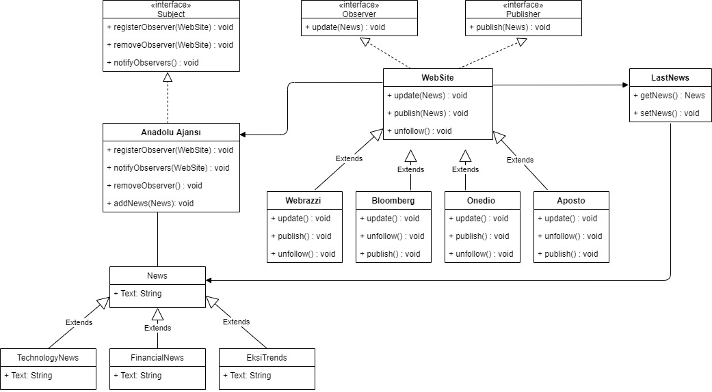

# Observer Pattern

The Observer Pattern defines a one-to-many dependency between objects so that when one objects changes state, all its dependents are notified and updated automatically.

**Loose Coupling**

When two objects are loosely coupled, they can interact, but have very little knowledge of each other.

The Observer Pattern provides an object design where subjects and observers are loosely coupled.

-The only thing the subject knows about an observer is that it implements a certain interface.

-We can add new observers or remove exist observers at any time.

-We never need to modify the subject to ad new types of observers.

-We can reuse subjects or observers independently og each other.

Changes to either the subject or an observer will not affect the other.

Project:
Anadolu Agency collects different types of news and distributes them to different websites.
Webrazzi only publishes technology news.
Bloomberg only publishes financial news.
Onedio only publishes the news that is the trending in Ekşi Sözlük.
Aposto, on the other hand, publishes all the news.

When new news comes with Swagger, Anadolu Agency sends this news to its followers.

